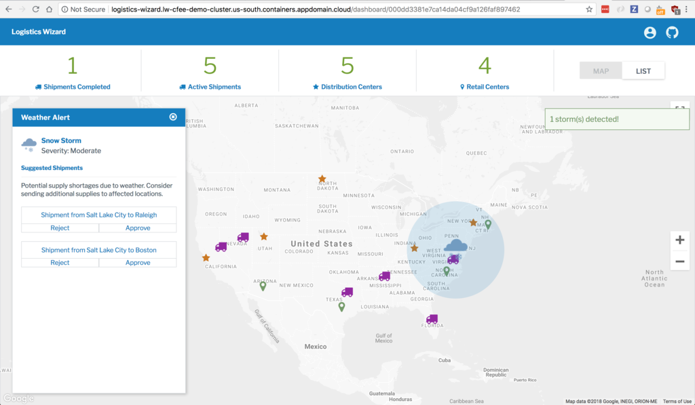

# Instructions to Deploy Microservices as Cloud Foundry Docker Apps

These are instructions to deploy Logistic Wizard to IBM Cloud. The Webui, ERP, and Controller can be deployed to IBM Cloud Cloud Foundry. The ERP and Controller services will be pushed to IBM Cloud CF using docker images while the Webui will be deployed as a regular CF app.

## Set up the ERP

1. Set up the database for the ERP:
   ```bash
   ibmcloud cf create-service cloudantNoSQLDB Standard logistics-wizard-erp-db
   ```
1. Open the Cloudant dashboard and create a database named `logistics-wizard`.
2. Then clone `logistics-wizard-erp` repo:
   ```sh
   git clone https://github.com/IBM-Cloud/logistics-wizard-erp
   cd logistics-wizard-erp
   ```
3. Build and push the image to docker hub.
   ```sh
   docker build -t <username>/logistics-wizard-erp:latest .
   docker push <username>/logistics-wizard-erp:latest
   ```
4. Create the ERP microservice in IBM Cloud without starting it using the docker image you created above
   ```sh
   ibmcloud cf push <erp-name> --docker-image=<username>/logistics-wizard-erp:latest --no-start
   ibmcloud cf bind-service <erp-name> logistics-wizard-erp-db --no-manifest
   ```
5. Start the ERP microservice:
   ```sh
   ibmcloud cf start <erp-name>
   ```
6. After starting the ERP microservice, you can verify it is running by hitting `https://<erp-name>.mybluemix.net/explorer`

## Set up the Controller Service

7. Clone the controller repo:
   ```
   git clone https://github.com/IBM-Cloud/logistics-wizard-controller
   cd logistics-wizard-controller
   ```
8. Build and push the image to docker hub.
   ```
   docker build -t <username>/logistics-wizard-controller:latest .
   docker push <username>/logistics-wizard-controller:latest
   ```
9. Create the controller microservice in bluemix without starting it using the docker image you created above
   ```
   ibmcloud cf push <controller-name> --docker-image=<username>/logistics-wizard-controller:latest --no-start --no-manifest
   ```

## Set up the WebUI

1. Clone the logistics-wizard-webui repo:
   ```sh
   git clone https://github.com/IBM-Cloud/logistics-wizard-webui
   cd logistics-wizard-webui
   ```
2. Install the dependencies
   ```sh
   npm install
   ```
3. Build the static files for the UI using the appropriate environment variables
   ```
   CONTROLLER_SERIVCE='<controller-service-url>' npm run deploy:prod
   ```
4. Deploy the app to bluemix
   ```
   cd dist
   ibmcloud cf push <webui-name> -b staticfile_buildpack --no-manifest
   ```

## Set up the Cloud Functions Actions

4. Clone the logistics-wizard-recommendation repo.
   ```bash
   git clone https://github.com/IBM-Cloud/logistics-wizard-recommendation
   cd logistics-wizard-recommendation
   ```
2. Create a `Cloudant` instance.
   ```bash
   ibmcloud cf create-service cloudantNoSQLDB Standard logistics-wizard-recommendation-db
3. Create a service key, **take note of the URL values as it would be needed in a later step.**
   ```bash
   ibmcloud cf create-service-key logistics-wizard-recommendation-db for-openwhisk
   ```
1. Retrieve the Cloudant credentials
   ```bash
   ibmcloud cf service-key logistics-wizard-recommendation-db for-openwhisk
   ```
5. Copy the local env template file.
   ```bash
   cp template-local.env local.env
   ```
6. Using the URL values from the terimal output above, update the local.env file to look like the following:
7. Build your Cloud Functions actions.
   Note: node version >=6.9.1 required and npm >=3.10.8

   ```bash
   npm install
   npm run build
   ```
8. Verify your setup, Here, we perform a blocking (synchronous) invocation of `echo`, passing it "hello" as an argument.
   ```bash
   ibmcloud fn action invoke /whisk.system/utils/echo -p message hello --result
   ```

   Output should be something like `{ "message": "hello" }`.
9. Deploy your Cloud Functions actions:
   ```bash
   ./deploy.sh --install
   ```
1. Make note of the URL to call functions.

## Start the controller app

1. Set the environment variables for the controller to connect to the ERP and to the Recommendation service. Run the below commands by providing appropriate values:

  ```bash
  ibmcloud cf set-env <controller-name> ERP_SERVICE 'https://<erp-URL>'
  ibmcloud cf set-env <controller-name> FUNCTIONS_NAMESPACE_URL <url-to-call-functions>
  ```
1. Start the controller microservice.
   ```bash
   ibmcloud cf start <controller-name>
   ```
1. Done, now access the WebUI URL in the browser and explore the app running on Docker in Cloud Foundry.
   
